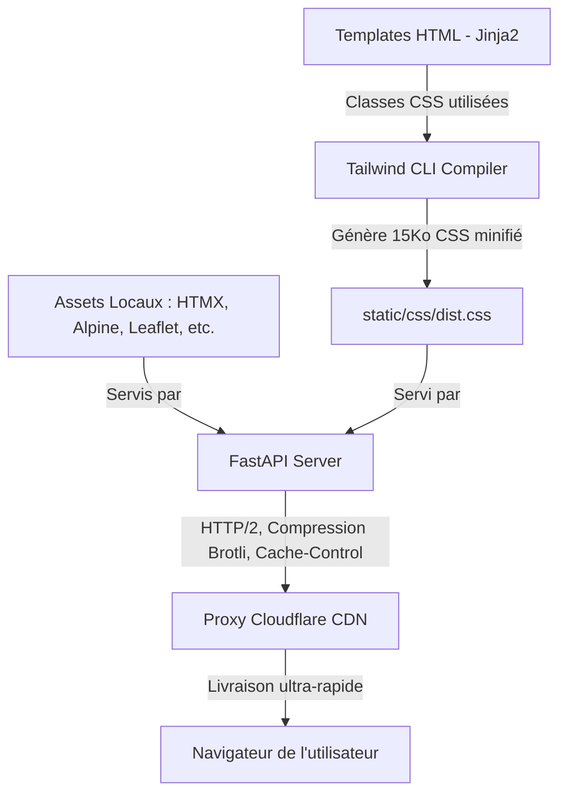

# Guide de Performance Frontend (Production) — TM Location

Ce document détaille la stratégie et les étapes de configuration pour optimiser les performances de l'affichage frontend de l'application **TM Location** en production.

---

## 🚀 Synthèse de la Solution Cible

Pour obtenir un affichage instantané, éviter les sauts de page sans style (FOUC), et assurer un fonctionnement robuste (y compris hors-ligne en développement), voici l'architecture recommandée :



---

## 🛠️ Plan d'Action pas à pas

### 1. Remplacer Tailwind Play CDN par la version Compilée (Tailwind CLI)
Le script `https://cdn.tailwindcss.com` charge un moteur lourd (~400Ko) qui analyse le DOM en temps réel. En production, il faut compiler le CSS à l'avance.

#### Étape A : Initialiser Node.js et installer Tailwind CSS dans le projet
Dans le terminal à la racine du projet :
```bash
npm init -y
npm install -D tailwindcss
npx tailwindcss init
```

#### Étape B : Configurer `tailwind.config.js`
Modifier le fichier de configuration pour lui indiquer quels fichiers analyser (les templates HTML et scripts JS) :
```javascript
/** @type {import('tailwindcss').Config} */
module.exports = {
  content: [
    "./app/templates/**/*.html",
    "./static/js/**/*.js"
  ],
  theme: {
    extend: {
      colors: {
        primary:        'var(--color-primary)',
        'primary-dark': 'var(--color-primary-dark)',
        'primary-light':'var(--color-primary-light)',
        secondary:      'var(--color-secondary)',
        accent:         'var(--color-accent)',
      },
      fontFamily: {
        sans: ['var(--font-main)'],
      },
    },
  },
  plugins: [],
}
```

#### Étape C : Créer le fichier source CSS (`static/css/src.css`)
Créer un fichier contenant les directives de base de Tailwind :
```css
@tailwind base;
@tailwind components;
@tailwind utilities;
```

#### Étape D : Compiler et minifier le CSS pour la production
Exécuter la commande de compilation qui supprime toutes les classes inutilisées :
```bash
npx tailwindcss -i ./static/css/src.css -o ./static/css/dist.css --minify
```
*Le fichier `dist.css` généré ne fera plus que 10 à 20 Ko et contiendra l'intégralité du design.*

---

### 2. Localiser les Dépendances Tierces (Plus de CDNs externes)
Télécharger les scripts de développement afin d'optimiser les connexions TCP/DNS et assurer le fonctionnement hors-ligne.

1. **HTMX** : Télécharger `https://unpkg.com/htmx.org@1.9.10/dist/htmx.min.js` et le placer dans `static/js/vendor/htmx.min.js`.
2. **Alpine.js** : Télécharger `https://cdn.jsdelivr.net/npm/alpinejs@3.x.x/dist/cdn.min.js` et le placer dans `static/js/vendor/alpine.min.js`.
3. **Leaflet** : Télécharger le CSS et JS de Leaflet et les stocker sous `static/css/vendor/leaflet.css` et `static/js/vendor/leaflet.js`.

---

### 3. Mettre à jour `base.html`
Modifier le fichier [[base.html](file:///Users/rakotomalala/TM_Location/app/templates/base.html)] pour utiliser uniquement les assets locaux compiles :

```html
<!-- Avant (Lenteurs, FOUC et Dépendance Internet) -->
<script src="https://cdn.tailwindcss.com"></script>
<script src="https://unpkg.com/htmx.org@1.9.10"></script>
<script defer src="https://cdn.jsdelivr.net/npm/alpinejs@3.x.x/dist/cdn.min.js"></script>

<!-- Après (Optimal, instantané et compatible offline) -->
<link rel="stylesheet" href="/static/css/dist.css">
<script src="/static/js/vendor/htmx.min.js" defer></script>
<script src="/static/js/vendor/alpine.min.js" defer></script>
```

---

### 4. Optimisation Serveur (FastAPI & Reverse Proxy)

#### A. Compression à la volée (Gzip/Brotli)
Dans FastAPI, vous pouvez ajouter le middleware de compression Gzip :
```python
from fastapi.middleware.gzip import GZipMiddleware
app.add_middleware(GZipMiddleware, minimum_size=1000)
```
*(Si vous utilisez Nginx en production, il est recommandé de laisser Nginx gérer la compression Gzip/Brotli).*

#### B. Cache-Control agressif pour les fichiers statiques
Configurez FastAPI pour envoyer des en-têtes de cache longue durée pour les fichiers statiques, car leur nom ou contenu change rarement :
```python
from fastapi.staticfiles import StaticFiles

class CachedStaticFiles(StaticFiles):
    def is_not_modified(self, response_headers, request_headers):
        response_headers["Cache-Control"] = "public, max-age=31536000, immutable"
        return super().is_not_modified(response_headers, request_headers)

app.mount("/static", CachedStaticFiles(directory="static"), name="static")
```

---

### 5. Utiliser Cloudflare en Front-End (CDN de Production)
* **Pourquoi ?** Cloudflare mettra en cache tout votre dossier `/static` sur ses serveurs edge mondiaux.
* **Résultat :** Pour un utilisateur à Madagascar, le CSS et le JS localisé seront chargés depuis le serveur Cloudflare le plus proche de lui (temps de réponse < 20ms au lieu d'une requête complète vers le serveur d'hébergement principal).
